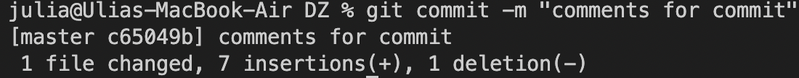
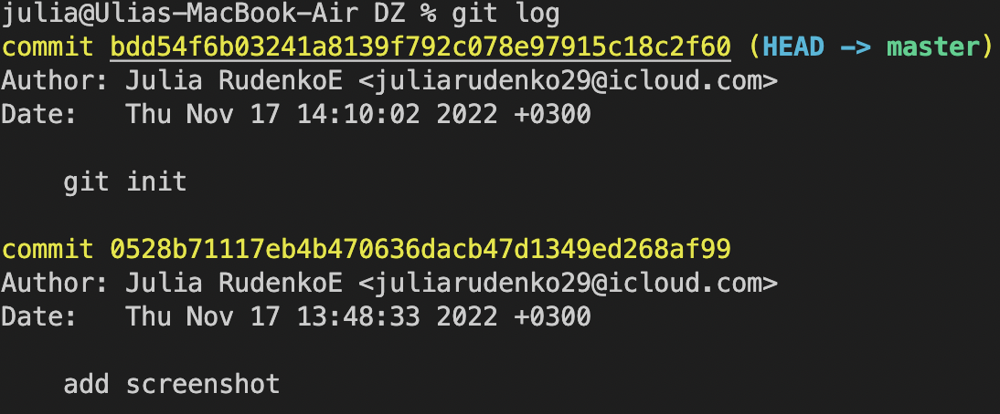
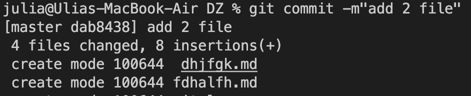

# Команды Git

## Git : ##
* самая популярная система контроля верций 

* главная фишка в том, что *Git* не хранит файлы целиком, а только отличия между ними, что позволяет экономить память

>  *Линус Торвальдс -*  Финно-американский программист, создатель операционной системы *Linux*, создатель *Git*.
________

## Комманды Git: ##
-------
* *"git --version"* -проверка текущей установленной версии программы

-------------
* *"git init"* -команда инициализации, после которой программа начнет отслеживать действия
--------
* *"git status"* - показывает текущее состояние гита, есть ли изменения, которые нужно сохранить 

 

-------

* *"git add"* - добавляет содержимое рабочего каталога в индекс для последующего коммита (дается только после дополнения файлов)

*** 

* *git commit -m"second"*- фиксирует и сохраняет добавленные изменения

_______

* *git commit -am"second"* - объединяет функции          
*git add* и *git commit*, удобнее использовать ее
-------
  
  * *"git log"* - журнал изменений, колличество сохранений с индивидуальным номером и коментарием к коммиту

  
  _________

* *"git checkout"* -  переключение между версиями

>Для работы нужно указать не только интересующий коммит, но и вернуться в исходное состояние при помощи команда *git chckout master* 
----------
* *"git add_."* - используется, когда нужно применить функцию *git add* для нескольких файлов. После нее нужно использовать функцию *git commit -m" "*

-----------
* *"git rm"* - удалить файл (указываем название файла)
--------
* *"git log -p"*- показывает все изменения
---------
* *"git diff ____ ____"* -показывает разницу между двумя коммитами. Необходимо ввести первые 4 символа от каждого коммита.
_________

## Инструкция по работе с Github

1. Создаем аккаунт на *Github.com*

2. Создаем локальный репозиторий

3. "Дружим" локальный и удаленный репозитории (*Github*, при создании нового репозитория покажет как это сделать)

4. Отправляем *(push)* локальный репозиторий в удаленный

5. Проводим изменения с др. комп.

6. Выкачиваем *(pull)* актуальное состояние из удаленного репозитория

## Команды:
 
* *git clone* - позволяет склонировать  внешний репозиторий на наш пк

* *git push* - отправляет изменения в удаленный репозиторий

* *git pull* - выкачивает данные из удаленного репозитория и делает слияние с локальным

## Инструкция по работе с *pull request*

1. Делаем копию *(fork)* интерисующего нас аккаунта

2. Создаем локальный репозиторий *(git clone)*

3. Создаем ветку и делаем изменения 

4. Направляем изменения в свой акк. *(push)*

5. Нажимаем кнопку *pull request*

* ## Pull request - запрос на вливание каких то изменений в основной репозиторий

